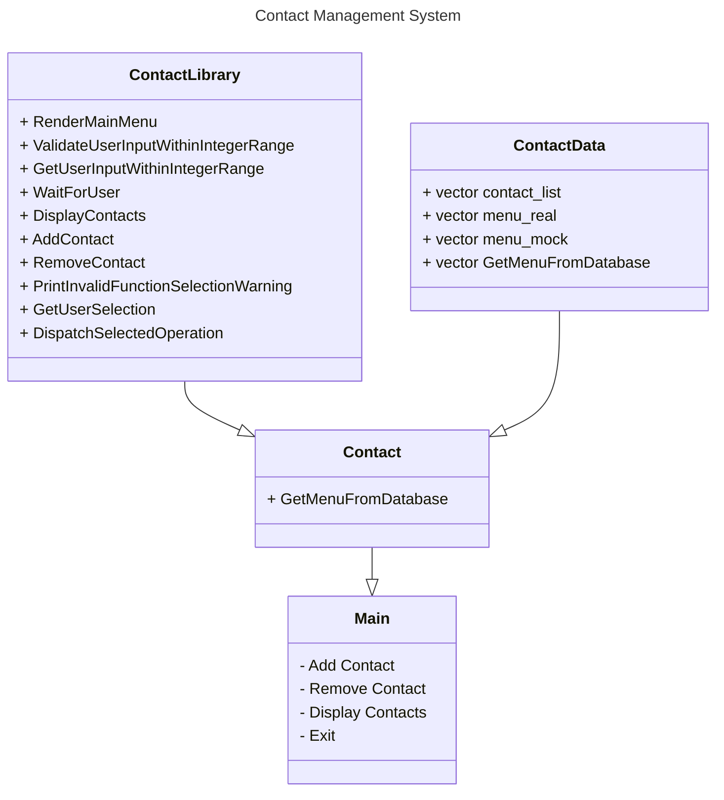

# Contact Management System Documentation

This program was built to allow the user to create a contact list for themselves. It is simple but it allows the user to:
- Add Contacts
- Remove Contacts
- View Contacts

## Rubric

| Goal | Points | Done?
| -- | -- | -- |
| 1. Your solution has **at least** 100 lines of code total across **all** `*.h` and `*.cpp` files | 2 points | Yes |
| 2. Your solution runs at least in baseline scenario | 2 points | Yes |
| 3. Instructor can not find a test scenario to bring your app to unhandled error/crash | 2 points | Hopefully |
| 4. You used structured code, with various tasks logically structured in properly names functions | 2 points | Yes |
| 5. You used some standard library class or function, eg `std::string` | 2 points | Yes |
| 6. You used structured error handling and exceptions | 2 points |  |
| 7. You designed and used a class | 2 points | Yes |
| 8. You split class design in header and implementations files | 2 points | Yes |
| 9. You use function overloading, for instance overloaded class constructor | 2 points |
| 10. You use private and public class members, class is designed with encapsulation in mind | 2 points |
| 11. You use class inheritance | 2 points |
| 12. You use pointers and/or pass-by-reference | 2 points | 
| 13. You provided app documentation in `Readme.md` file (doesn't need to be long, but please use markdown) | 2 points | Yes |
| 14. You added class diagram to app documentation | 2 points | Yes |
| 15. You recorded a demo showcasing the UI and included (accessible) link in documentation | 2 points | Yes |
| 16. Early bird: assignment is submitted by `Early bird` deadline (see in BlackBoard, under assignment folder) | 2 points |

## Class Diagram

### You can watch the demonstration here: [Tutorial](https://youtu.be/XM5LJrBlHvQ)